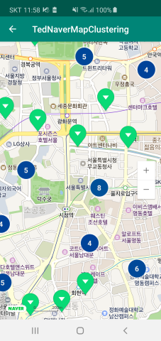

 
# TedNaverMapClustering


TedNaverMapClustering는 `네이버지도용 클러스터 유틸리티 라이브러리`입니다.
- 클러스터링을 사용하려면 Google지도를 사용해야 했습니다.</br>
: Google지도에서만 [Clustering Utility](https://developers.google.com/maps/documentation/android-sdk/utility/marker-clustering)를 통해 클러스터링을 지원했으니까요
- 한국에서 앱을 서비스하기에는 네이버지도가 더 좋은 기능들이 많지만 클러스터링을 사용하려면 어쩔수 없이 Google지도를 사용할 수 밖에 없었죠..
- 네이버지도 팀에서 클러스터링기능을 지원해주면 좋겠지만 `나오겠지...나오겠지..` 그렇게 몇년이 지나도 클러스터링 기능은 나오지 않았습니다.

## 그래서 네이버지도용 클러스터링 라이브러리를 만들었습니다


| 스크린샷                    | 사용예시                                  |
|:------------------------------:|:---------------------------------:|
| | |


## 설정


### Gradle
[  ](https://bintray.com/tkdrnjs0912/maven/tedclustering-naver/_latestVersion)
```gradle
dependencies {
    implementation 'gun0912.ted:tedclustering-naver:x.y.z'
    //implementation 'gun0912.ted:tedclustering-naver:1.0.2'
}

```
라이브러리가 유용했다면 위쪽에 별표 버튼을 눌러 저를 신나게 해주세요. </br>


</br></br>

## 사용법
*Repository의 샘플앱을 실행하시고 코드를 보시면 더 쉽게 이해하실 수 있습니다.*
</br></br>
### 1. ClusterItem 구현
- 클러스터링에 쓰일 Model에 `TedClusterItem` interface를 implements
- `getTedLatLng()`함수를 구현
#### Kotlin
- [NaverItem](https://github.com/ParkSangGwon/TedNaverMapClustering/blob/master/app/src/main/java/ted/gun0912/clustering/naver/demo/NaverItem.kt)
```kotlin

data class NaverItem(var position: LatLng) : TedClusterItem {
    ...
    override fun getTedLatLng(): TedLatLng {
        return TedLatLng(position.latitude, position.longitude)
    }
    ...
}
```
#### Java
- [JavaItem](https://github.com/ParkSangGwon/TedNaverMapClustering/blob/master/app/src/main/java/ted/gun0912/clustering/naver/demo/JavaItem.java)
```java
public class JavaItem implements TedClusterItem {
    ...
    @NotNull
    @Override
    public TedLatLng getTedLatLng() {
        return new TedLatLng(latLng.latitude, latLng.longitude);
    }
    ...
}
```
### 2. TedNaverClustering 구현
- 클러스터링을 위해 TedNaverClustering를 구현해줍니다.
#### Kotlin
```kotlin
TedNaverClustering.with<NaverItem>(this, naverMap)
    .items(getItems())
    .make()
```
#### Java
```java
TedNaverClustering.with(this, naverMap)
        .items(getItems())
        .make();     
```

</br></br>
## 커스터마이징
- 필요한 여러 기능들을 마음대로 변경할 수 있습니다.

### 모양 변경
* `customCluster()` : 클러스터 View를 원하는 모양으로 변경
* `customMarker()`: 마커를 원하는 모양으로 변경
* `clusterText()`: 클러스터에 표시될 텍스트 변경
* `clusterBackground()`: 클러스터에 표시될 배경색 변경

### Listener
* `markerClickListener()`: 마커 클릭 Listener
* `clusterClickListener()`: 클러스터 클릭 Listener
* `markerAddedListener()`: 마커가 추가될때 호출되는 Listener
* `clusterAddedListener()`: 클러스터가 추가될때 호출되는 Listener

### 애니메이션
* `clusterAnimation()`: 클러스터->마커, 마커->클러스터 변경될때 애니메이션 유무
* `clickToCenter()`: 클러스터/마커 클릭시 지도 가운데로 이동되는 애니메이션 유무

### 기타
* `minClusterSize()`: 클러스터로 보여줄 최소 개수
* `clusterBuckets()`: 클러스터링 기준 범위 목록 설정
* `setAlgorithm()`: 직접 구현한 알고리즘 설정


## FAQ
### 클러스터링을 만드는 알고리즘은 어떻게 되나요?
- `TedNaverMapClustering`의 클러스터링 알고리즘은 GoogleMap의 클러스터링 알고리즘과 같은 방식으로 클러스터링 됩니다.
- [Efficient Filtering and Clustering Mechanism for Google Maps](http://www.joams.com/uploadfile/2013/0426/20130426033622753.pdf)
- [NonHierarchicalDistanceBasedAlgorithm](https://github.com/googlemaps/android-maps-utils/blob/master/library/src/com/google/maps/android/clustering/algo/NonHierarchicalDistanceBasedAlgorithm.java)
- 본인만의 알고리즘으로 클러스터링을 하길 원하는경우 [ScreenBasedAlgorithm](https://github.com/ParkSangGwon/TedNaverMapClustering/blob/8e709a1b6238962b4207d2e73db28d3d5941fb5e/tedclustering/src/main/java/ted/gun0912/clustering/clustering/algo/ScreenBasedAlgorithm.kt)를 상속받아 알고리즘을 구현하고 `setAlgorithm()`로 설정해주면 됩니다.

### 다른 지도도 비슷한 방식으로 클러스터링을 만들 수 있나요?
- `TedNaverMapClustering`은 네이버지도 뿐만 아니라 어떤 지도도 클러스터링을 지원할 수 있도록 설계되어 있습니다.
- [tedclustering](https://github.com/ParkSangGwon/TedNaverMapClustering/tree/master/tedclustering) 모듈은 특정 지도에 속해있지 않기 때문에 클러스터링이 필요한 어떤 지도든 확장가능합니다.
- 하지만 현재 [Google지도](https://developers.google.com/maps/documentation/android-sdk/utility/marker-clustering)와 [Tmap지도](http://tmapapi.sktelecom.com/main.html#android/docs/androidDoc.TMapMarkerItem_setEnableClustering)는 공식적으로 클러스터링을 지원하고 있기 때문에 추후 클러스터링이 필요한 지도가 있다면 라이브러리형태로 추가되서 지원할 예정입니다.

</br></br>
## License 
 ```code
Copyright 2019 Ted Park

Licensed under the Apache License, Version 2.0 (the "License");
you may not use this file except in compliance with the License.
You may obtain a copy of the License at

http://www.apache.org/licenses/LICENSE-2.0

Unless required by applicable law or agreed to in writing, software
distributed under the License is distributed on an "AS IS" BASIS,
WITHOUT WARRANTIES OR CONDITIONS OF ANY KIND, either express or implied.
See the License for the specific language governing permissions and
limitations under the License.```
